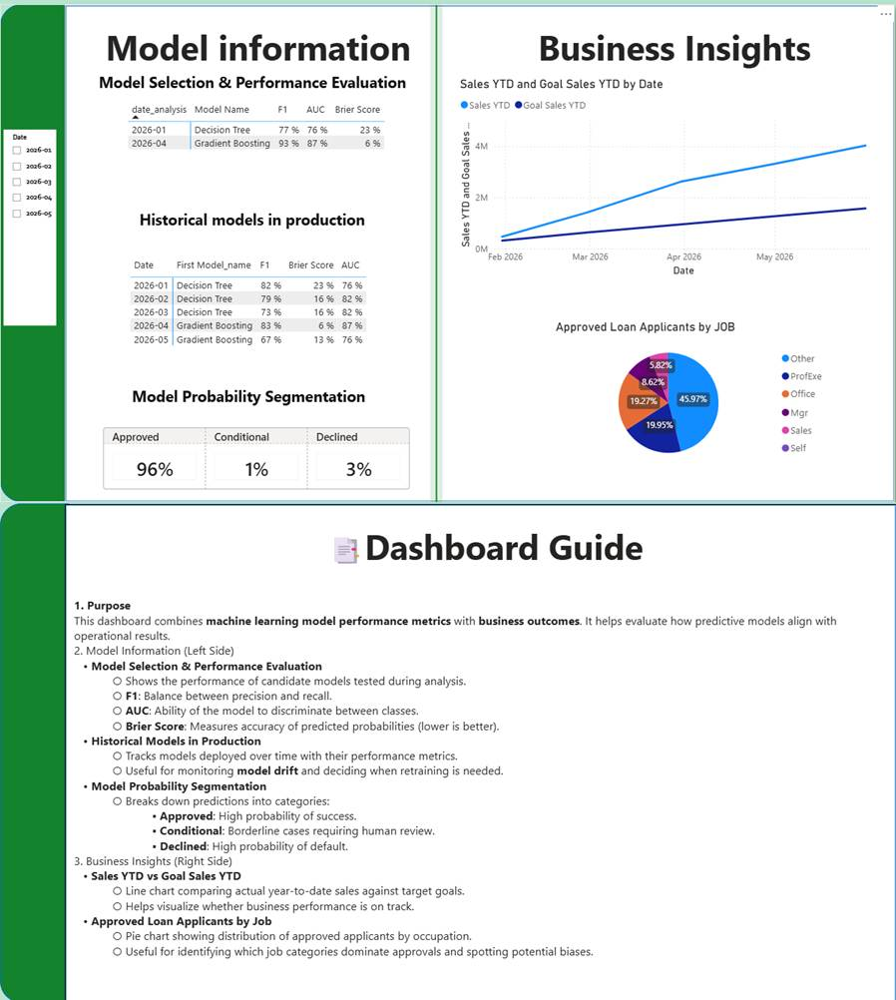
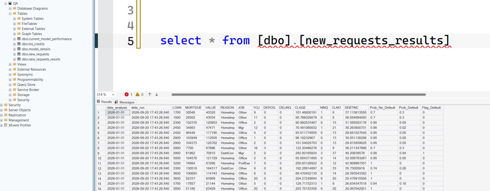

🏦 Mortgage Default Prediction

🎯 Goal
Predict the default probability of mortgage requests before the bank approves them, enabling proactive risk management and informed decision-making.

🔑 Key Aspects of the Project
Model Monitoring & Drift Detection  
The production model is continuously monitored. If performance deteriorates, candidate models are reevaluated to identify the best-performing option.

Database Integration  
The model consumes data and exports predictions and performance metrics to a SQL Server database, ensuring structured storage and efficient queries.

Power BI Dashboard  
A dashboard connected to the database summarizes approved applications and displays model performance metrics, facilitating monitoring and decision-making.

📂 Data Preparation
The folder Database_Inputs has the following:

Three SQL queries that creates new tables to store project information.

Two Excel files, the import process is carried out using the SSMS wizard (Tasks → Import Data).

Excel Files:

Historical.xlsx → uploaded to table his_credits.
Simulates historical information from mortgages that were either paid off or defaulted.

new_requests.xlsx → uploaded to table new_request.
Simulates new mortgage applications received month by month.

📑 Workflow 

Parameters: Defines the initial configuration for default probability calculations.
DB_connection: Establishes the connection to the SQL database where data is stored and retrieved.

🔹 Data Engineering
dropNAValues: Cleans the dataset by removing missing values.

TrainingTestingSplit: Splits the dataset into training and testing sets.

PipelineTransform: Applies reproducible transformations through a pipeline.

ColumnTransformApplication: Executes column-specific transformations (e.g., normalization, encoding).

🔹 Model Selection Workflow

Choosing_top_models: Selects candidate models with the best initial performance.

Choosing_best_parameters_model: Tunes hyperparameters to optimize results.

Loading_model_parameters: Loads the selected parameters for the final model.

🔹 Loading Model
Retrieving_best_model: Retrieves the best-performing model for production.

Evaluating_new_historical_data: Evaluates newly added historical data.

Predicting_new_requests: Generates predictions for new mortgage applications.

## 📊 Project Artifacts

### Dashboard
  
This dashboard displays business and model performance metrics, including loan approvals, sales trends, and segmentation results.

### Database Screenshot
  
This screenshot highlights the SQL Server database, showing the list of tables used in the project and an example of how the model’s prediction results are stored.

### UML Diagram
  
This UML diagram illustrates the system architecture, including data ingestion, model training, prediction workflow, and database integration.
